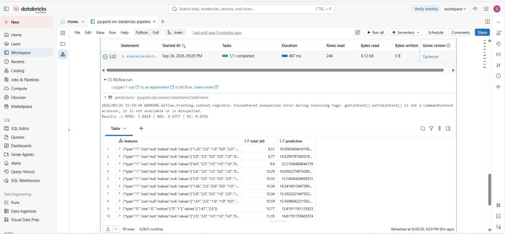
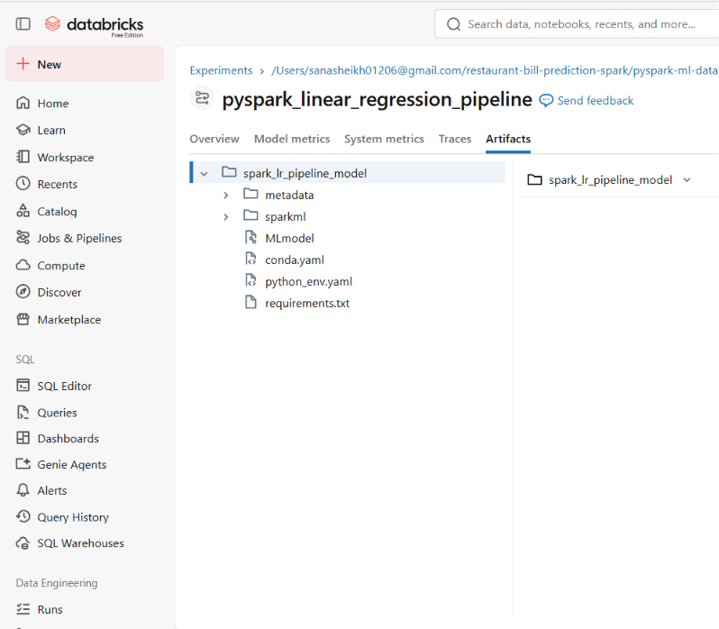

# End-to-End Restaurant Bill Regression with PySpark & Databricks

[](https://community.cloud.databricks.com/)
[](https://spark.apache.org/)
[](https://mlflow.org/)
[](https://www.python.org/)

A distributed machine learning pipeline built on **Databricks** using **PySpark MLlib** and **MLflow** to predict restaurant bill totals (`total_bill`) based on customer demographic data and dining party details.

---

## Architecture & Pipeline Design

```text
[Unity Catalog: tips] ---> [Train/Test Split (80/20)]
                                     │
                                     ▼
                ┌──────────────────────────────────────────┐
                │          Spark MLlib Pipeline            │
                │                                          │
                │  1. StringIndexer (Categorical features) │
                │  2. VectorAssembler (Feature vector)     │
                │  3. LinearRegression (regParam=0.1)      │
                └──────────────────────────────────────────┘
                                     │
                                     ▼
             [MLflow Tracking] ---> (Metrics, Parameters, Saved Model)
```

### Key Engineering Practices:
* **Zero Data Leakage:** The `StringIndexer` and feature transformations are fitted strictly on `train_df` after a controlled 80/20 split.
* **Out-of-Vocabulary Protection:** Configured `handleInvalid="keep"` on categorical encoders to prevent inference failures on unseen categories.
* **Unified Pipeline Orchestration:** Bundles encoding, vector assembly, and regression into a single repeatable workflow.
* **Full MLOps Tracking:** Evaluated metrics and serialized pipeline artifacts are automatically registered via **MLflow**.

---

## Dataset Schema

The pipeline consumes tabular restaurant transaction data managed via Unity Catalog (`workspace.default.tips`):

| Column | Type | Role | Description |
| :--- | :--- | :--- | :--- |
| `total_bill` | `Double` | **Target (y)** | Total financial amount for the meal (USD) |
| `tip` | `Double` | Feature | Tip amount given |
| `sex` | `String` | Feature | Payer gender (`Male`, `Female`) |
| `smoker` | `String` | Feature | Smoking table indicator (`Yes`, `No`) |
| `day` | `String` | Feature | Day of the week (`Thur`, `Fri`, `Sat`, `Sun`) |
| `time` | `String` | Feature | Meal category (`Lunch`, `Dinner`) |
| `size` | `BigInt` | Feature | Number of people in the dining party |

---

## Model Evaluation & Performance

Evaluation was conducted against an independent hold-out test set using PySpark's `RegressionEvaluator`:

| Metric | Score | Description |
| :--- | :--- | :--- |
| **$R^2$** | **0.6591** | Coefficient of Determination |
| **MAE** | **4.4757** | Mean Absolute Error |
| **RMSE** | **5.8418** | Root Mean Squared Error |

---

## Visual Verification & Artifacts

### 1. Distributed Pipeline Execution in Databricks
Execution logs confirming model fitting, evaluation metrics, and the prediction DataFrame output running on active Databricks compute:



### 2. Logged MLflow Model Artifacts
The serialized `spark_lr_pipeline_model` directory showing packaged pipeline stages, metadata, and environment dependencies:



---

## Project Structure

```text
├── pipeline_execution.png
├── mlflow_artifacts.png
├── notebooks/
│   └── pyspark_ml_databricks_pipeline.py
└── README.md
